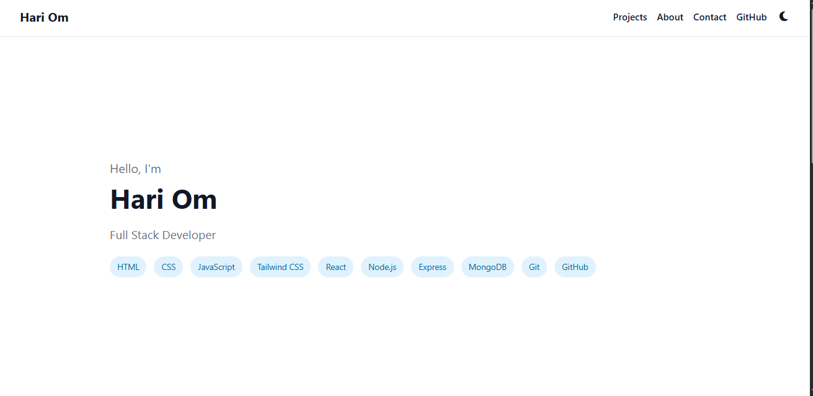
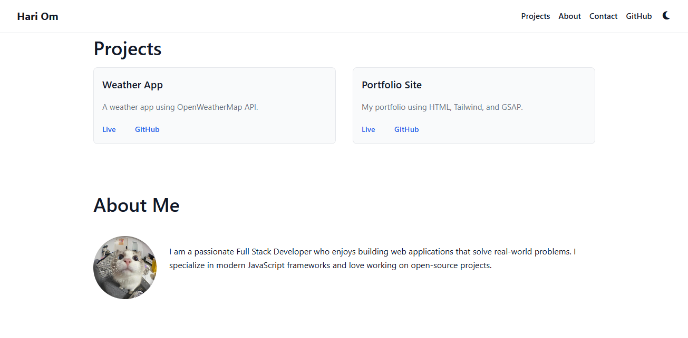
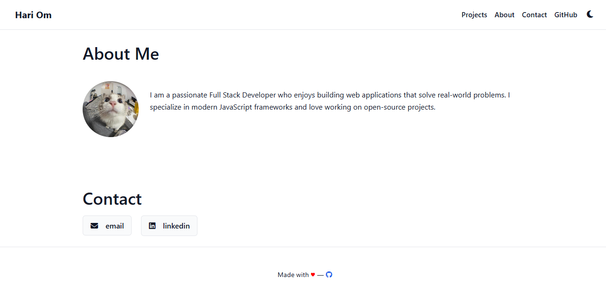

## 🌐 Portfolio Website with Advanced Animations

**Name:** Hari Om

**Company:** CODTECH IT SOLUTIONS

**Intern ID:** COD123

**Domain:** Frontend Web Development

**Duration:** 4 Weeks

**Mentor:** Neela Santosh

### Introduction

Hi, I’m **Hari Om**, a passionate web developer and learner. This repository houses the complete source code for my **personal portfolio website**, developed as part of my internship at CODTECH IT SOLUTIONS.

The goal of this project was to craft a modern, animated, and responsive website to showcase my technical skills, personal background, and development journey in web technologies.

---

### What This Project Includes

*  Fully responsive **portfolio website** layout
*  Structured content using **HTML5**
*  Custom styles and layout with **CSS3**
*  Interactive components and animations powered by **JavaScript**
*  Smooth, scroll-based motion and reveal effects via **GSAP (GreenSock Animation Platform)**
*  **Dark mode toggle** using localStorage and CSS variables
*  Dynamic data loading from a JSON file (`data.json`)
*  Sections: Hero, Projects, About Me, Contact, and Footer
*  Font Awesome icons integration for contact and social links

---

### Key Features

* **Clean UI & UX:** Intuitive layout with accessible navigation
* **Dark Mode:** Users can toggle between light and dark themes
* **GSAP Animations:** Scroll-triggered entrance animations for sections and elements
* **Modular Structure:** Dynamic rendering of projects, tech skills, and contact links
* **Performance-Friendly:** Deferred script loading and minimal render-blocking

---

### Technologies Used

| Tech         | Description                             |
| ------------ | --------------------------------------- |
| HTML5        | Semantic content structure              |
| CSS3         | Styling and responsive design           |
| JavaScript   | DOM manipulation and interactivity      |
| GSAP         | Animations and scroll-based transitions |
| Font Awesome | Iconography for links and buttons       |
| JSON         | Used for dynamic data population        |

---

### What I Learned

* Creating dynamic and modular web pages using pure JavaScript
* Integrating **GSAP** for performant animations
* Responsive design principles using flex/grid
* Working with external data (JSON) to keep content maintainable
* Theme management using **CSS variables** and **localStorage**

---

### Sections of the Website

* **Hero:** Animated intro with name, role, and tech stack
* **Projects:** Dynamically rendered project cards with live/GitHub links
* **About Me:** Personal description and developer photo
* **Contact:** Social/contact links with icons
* **Footer:** Simple credits with animated GitHub icon

---

### Final Thoughts

Building this portfolio was a great opportunity to reinforce my understanding of core web development principles. I explored how to make static pages feel dynamic using JavaScript and animations, making the user experience more engaging and enjoyable.

This is not just a finished project—it's a **foundation**. I plan to continuously update it with new projects and technologies as I grow in the frontend development space.

---

### 🔗 Live Preview

