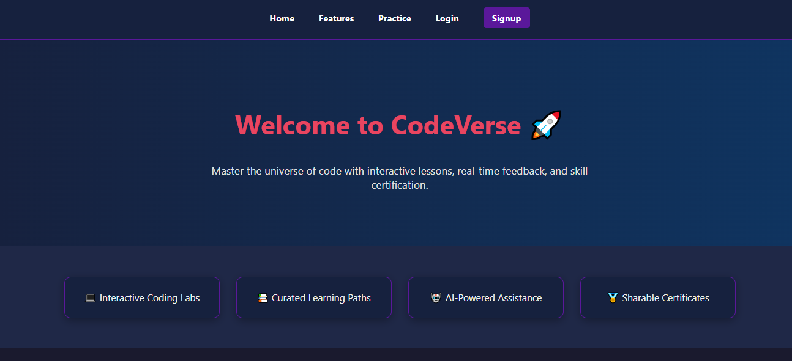
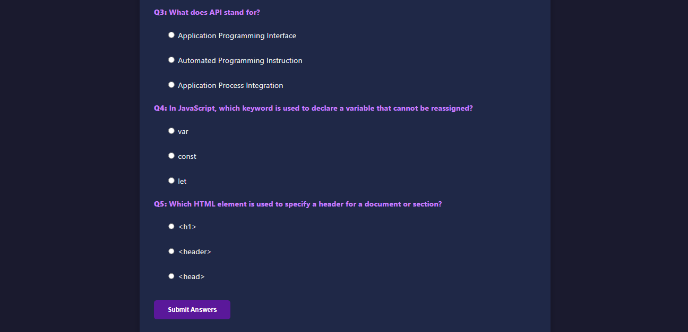
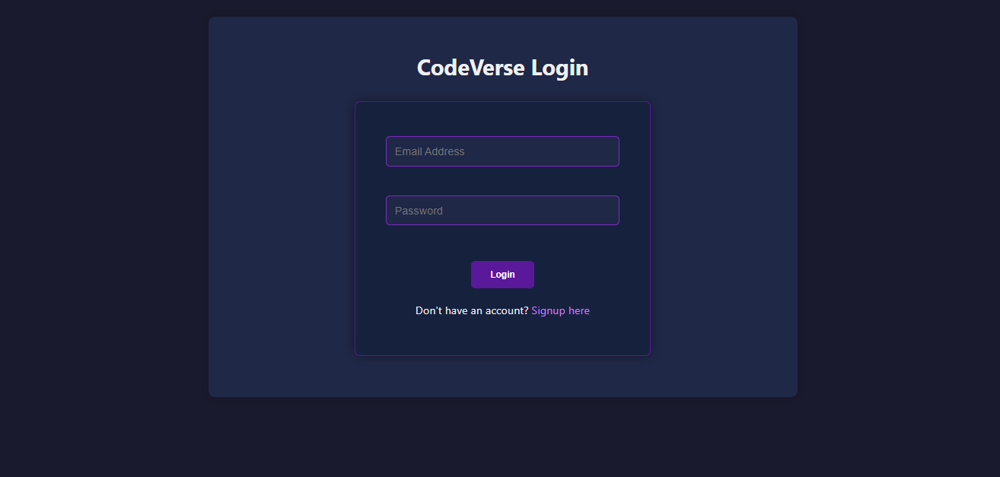

# ONLINE-LEARNING-PLATFORM

## CodeVerse – Interactive Coding & Learning Platform

- **Name:** Hari Om
- **Company:** CODTECH IT SOLUTIONS
- **Intern ID:** COD123
- **Domain:** Frontend Web Development
- **Duration:** 4 Weeks
- **Mentor:** Neela Santosh

---

### Project Overview

**CodeVerse** is a frontend web application developed as part of my internship at **CODTECH IT SOLUTIONS**. This platform is designed to help users learn coding through interactive lessons, real-time quizzes, and basic user authentication. It demonstrates my skills in frontend development and showcases my ability to create responsive, user-centric interfaces.

---

### Objective

To build a modern, responsive web-based learning tool that features:

* A welcoming homepage with key highlights
* A coding quiz to test fundamental knowledge
* A login/signup system using browser-based storage
* Clear user feedback and session handling
* Clean UI and smooth navigation

---

### Key Features

* Modern UI with responsive layout
* User authentication using HTML, JavaScript, and localStorage
* Quiz module with instant scoring and feedback
* Hover effects and transitions for enhanced interactivity
* Session-based login/logout visibility
* Fully responsive for mobile and desktop devices

---

### Technologies Used

| Technology   | Purpose                               |
| ------------ | ------------------------------------- |
| HTML5        | Structuring content and layout        |
| CSS3         | Styling and responsive design         |
| JavaScript   | Form handling, validation, quiz logic |
| localStorage | Persistent data storage in-browser    |

---

### Pages & Functionality

1. **index.html** – Homepage

   * Hero section with welcome text
   * Feature highlights
   * Coding quiz section
   * Dynamic login/logout link visibility

2. **login.html** – User login

   * Accepts email and password
   * Checks credentials against stored users
   * Displays success or error messages

3. **signup.html** – User registration

   * Accepts username, email, and password
   * Validates existing users
   * Saves new user details to localStorage

4. **script.js** – Core functionality

   * Handles quiz submission and scoring
   * Manages login/logout state
   * Controls UI updates on load

5. **style.css** – Design and layout

   * Dark-themed user interface
   * Responsive layouts using Flexbox
   * Button and form styles
   * Interactive hover states

---

### Quiz Logic Summary

* Real-time feedback for each question
* Color-coded results for correct, incorrect, and unanswered questions
* Final score display based on total correct answers

---

### Learning Outcomes

* Practical application of DOM manipulation and JavaScript logic
* Client-side user authentication using localStorage
* Responsive UI creation with consistent styling
* Form validation and dynamic feedback handling
* Session control through JavaScript

---

### Future Improvements

* Expand quiz question bank and add categories
* Introduce a timer and score tracking history
* Connect to a backend database for persistent accounts
* Add dashboard for user progress
* Integrate basic AI for quiz hints or performance tracking

---

### Conclusion

Developing **CodeVerse** has significantly enhanced my understanding of frontend technologies. It reflects my ability to apply web development concepts in a practical, structured way. This project is an important step in my journey to becoming a proficient frontend developer, and I look forward to extending it with more features and functionality in the future.

#OUTPUT

