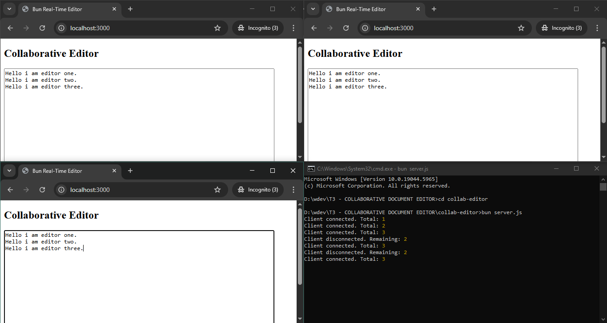

## **COLLABORATIVE DOCUMENT EDITOR**

---

### PROJECT TITLE

**Real-Time Collaborative Document Editor**
A lightweight proof-of-concept for multi-user live editing using WebSockets and vanilla JavaScript.

---

### INTERN DETAILS

**Developer:** Hari Om
**Intern ID:** COD123
**Organization:** CODTECH IT SOLUTIONS
**Mentor:** Neela Santosh
**Duration:** 4 Weeks
**Internship Domain:** Frontend Web Development

---

### PROJECT OVERVIEW

This real-time collaborative editor allows multiple users to edit shared content simultaneously through WebSocket-based synchronization. Designed without frontend frameworks, it demonstrates how real-time collaboration can be achieved using pure JavaScript and the Bun runtime.

---

### PROJECT SETUP & RUNNING LOCALLY

To test or deploy this project locally:

1. **Install Bun**
   Visit [https://bun.sh](https://bun.sh) and run:

   ```bash
   curl -fsSL https://bun.sh/install | bash
   ```

2. **Clone or download the project folder**

3. **Navigate to the root folder**

   ```shell
   cd collab-editor
   ```

4. **Run the Bun server**

   ```shell
   bun server.js
   ```

5. **Open the app in your browser**
   Go to [http://localhost:3000](http://localhost:3000)
   Open in multiple tabs to test collaboration in real-time.

---

### CORE FEATURES

* Real-time sync between connected users
* WebSocket-based communication
* Simple and intuitive UI
* Lightweight: no frameworks or databases
* Built using Bun runtime for speed and simplicity

---

### TECH STACK

| Technology    | Purpose                             |
| ------------- | ----------------------------------- |
| HTML5         | Document structure                  |
| CSS3          | Basic layout and UI                 |
| JavaScript    | DOM updates, WebSocket client logic |
| Bun Runtime   | Backend HTTP and WebSocket server   |
| WebSocket API | Real-time sync between clients      |

---

### FUNCTIONALITY BREAKDOWN

**WebSocket Backend (Bun):**

* Serves static files
* Handles fetch and WebSocket upgrade requests
* Broadcasts text changes to connected clients

**Editor Frontend (index.html):**

* Editable textarea
* Event listeners for input changes
* Receives and reflects remote edits
* Input guard to avoid feedback loops

---

### UI COMPONENTS

* Textarea editor (shared input field)
* Clean, distraction-free interface
* Console-based feedback and debugging

---

### FILE STRUCTURE

```
/ (Root)
├── server.js              → Bun WebSocket + HTTP server
├── /public/
│   └── index.html         → Editor UI + client-side JS
```

---

### LEARNING HIGHLIGHTS

* Using Bun's native HTTP server and WebSocket support
* Managing client connections and data flow
* Handling real-time synchronization logic
* Building event-driven systems
* Developing without external libraries or frameworks

---

### POSSIBLE ENHANCEMENTS

* Rich text formatting
* Cursor sharing across users
* User presence indicators
* Document saving with a database
* Local offline storage using IndexedDB

---

### CONCLUSION

This collaborative editor project demonstrates the core mechanics behind real-time applications. It emphasizes simplicity and performance, providing a foundational understanding of how multi-user editing tools work. It also offered hands-on experience with emerging tools like Bun and practical application of WebSocket communication.

---

### Screenshot:
