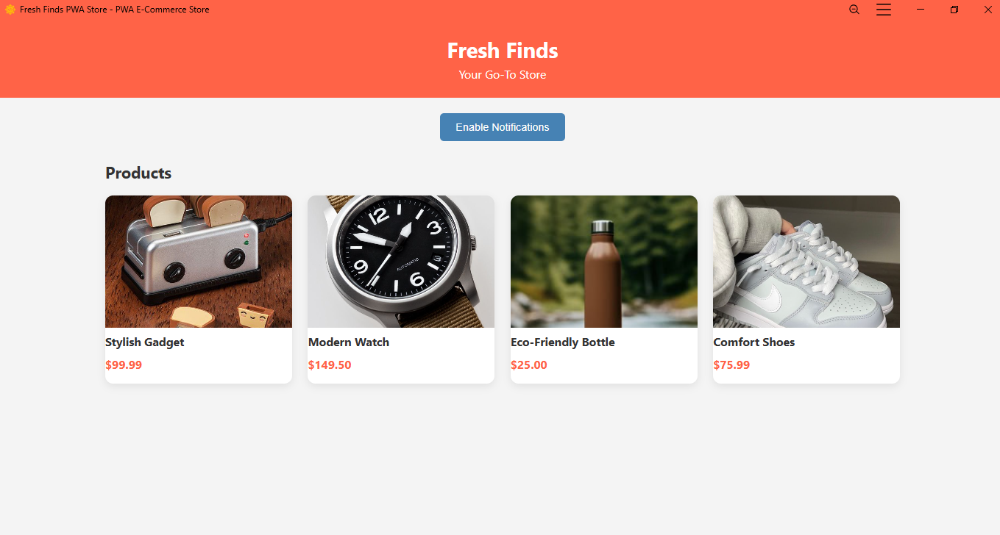

## Fresh Finds – PWA E-Commerce Store

**Developer:** Hari Om
**Intern ID:** COD123
**Organization:** CODTECH IT SOLUTIONS
**Internship Domain:** Frontend Web Development
**Mentor:** Neela Santosh
**Duration:** 4 Weeks

---

### 🔹 Overview

**Fresh Finds** is a Progressive Web App (PWA) built as part of my internship project. It is a mobile-responsive e-commerce storefront that delivers a smooth and engaging shopping experience, even with limited or no internet connectivity. This project demonstrates the integration of core frontend development practices with modern PWA features.

---

### 🔹 Core Features

* **Responsive Product Grid** for mobile and desktop
* **Service Worker Caching** for offline support
* **Installable PWA** via `manifest.json`
* **Notification Support** using Push API
* **Smooth UI Interactions** with hover effects and transitions

---

### 🔹 Technologies Used

| Technology   | Purpose                                    |
| ------------ | ------------------------------------------ |
| HTML5        | Markup and structure                       |
| CSS3         | Styling, layout, responsive design         |
| JavaScript   | Interactivity, service worker logic        |
| Web APIs     | Notifications, Cache API, Push API         |
| PWA Features | Manifest, offline support, app shell model |

---

### 🔹 PWA Capabilities

#### 1. **Service Worker (sw\.js)**

Handles:

* Installation and caching of app shell resources
* Interception of fetch events to serve cached content offline
* Push notification support
* Cleanup of outdated caches on activation

#### 2. **Web Manifest (manifest.json)**

Provides:

* App name and icons for install prompt
* Theme and background color
* Home screen launch support

#### 3. **Notifications**

* Users can enable browser-based notifications
* Permission is requested and stored
* Push-ready setup with `self.addEventListener('push', ...)`

---

### 🔹 UI Components

* **Header**: Branding and tagline
* **Product Grid**: Four product cards with images, names, and prices
* **Action Button**: "Enable Notifications" with user feedback
* **Offline Support**: Cached assets available after first load

---

### 🔹 Folder & File Structure

```
/ (Root)
│
├── index.html              → Main UI page
├── app.js                  → JS for service worker & notifications
├── style.css               → Responsive and card styles
├── sw.js                   → Service Worker for caching, push
├── manifest.json           → PWA metadata
├── /images/                → App icons for manifest
└── /icons/ (optional)      → Alternative notification icons
```

---

### 🔹 Learning Highlights

* Implementing a **Service Worker** lifecycle
* Using the **Cache API** to store and serve assets offline
* Creating a **Web App Manifest** for installability
* Working with **Push Notifications API**
* Building **responsive and accessible UIs**

---

### 🔹 Possible Enhancements

* Add product categories and cart functionality
* Integrate backend for real-time updates and orders
* Use IndexedDB for offline data storage
* Connect with Firebase or another push service for live notifications

---

### 🔹 Conclusion

This PWA e-commerce store project has given me real-world experience in building scalable and progressive frontend applications. From mastering offline-first strategies to enabling notifications and user interactions, this project represents the foundation of my journey in modern web development.

---
### Screenshot:
